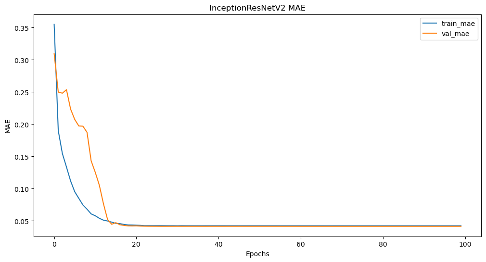
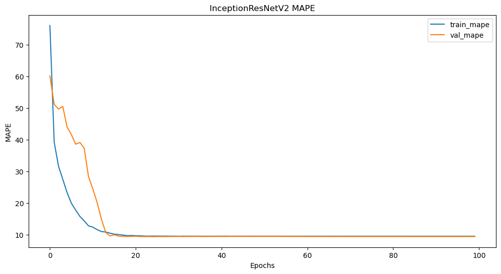
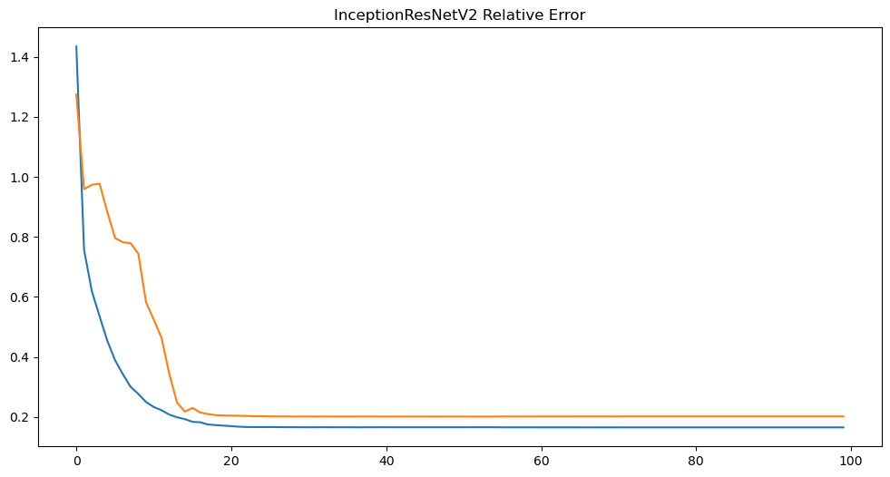
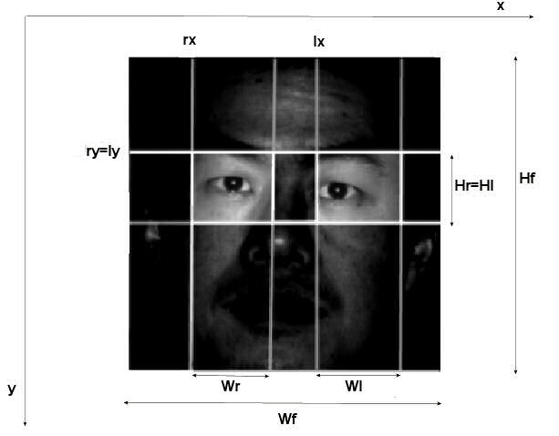

# Eye Feature Localization Using InceptionResNetV2

This project implements a deep learning pipeline for **predicting eye keypoints** (left/right eye coordinates) from facial images using **transfer learning** with **InceptionResNetV2**. The approach uses a combination of data augmentation, frozen convolutional layers, and a custom relative error metric to evaluate model performance.

---

## 📁 Project Structure

```
├── Code.ipynb
├── Report.pdf
├── images/
│   ├── report_img_14_1.jpeg
│   ├── report_img_20_1.jpeg
│   ├── report_img_32_1.png
│   ├── report_img_33_1.png
│   ├── report_img_34_1.png
│   ├── report_img_35_1.png
```

---

## 🚀 Highlights

- ✅ Transfer learning using **InceptionResNetV2**
- ✅ Eye keypoint regression using image features
- ✅ Custom **relative error** metric for accuracy
- ✅ Visual analysis of **loss, MAE, MAPE**, and model architecture
- ✅ Evaluation on a custom dataset of annotated eye positions

---

## 📊 Sample Results

### Training & Evaluation

  
*Training vs Validation Loss*

  
*Mean Absolute Error over epochs*

  
*Mean Absolute Percentage Error*

  
*Custom Relative Error across epochs*

---

## 🧠 Model Architecture



- **Base Model:** InceptionResNetV2 (pretrained on ImageNet)
- **Trainable Layers:** Only the top layers
- **Top Layers:** Dense(128) → Dropout → Dense(64) → Output(4)

---

## 📦 Installation

Make sure you have Python 3.7+ and install the dependencies:

```bash
pip install tensorflow pandas numpy matplotlib
```

---

## ▶️ Usage

To train the model and reproduce results:

```bash
python main.py
```

For detailed step-by-step insights, use the Jupyter notebook `Code.ipynb`.

---

## 📂 Dataset

- Facial images labeled with CSV files containing:
  - `lx`, `ly`, `rx`, `ry` → Left and Right Eye Coordinates
- Image preprocessing includes resizing, augmentation, and normalization.
- Relative error is computed using eye width (`w`) to normalize Euclidean distance.

---

## 📚 References

- **InceptionResNetV2**: Szegedy et al. (2017)
- **TensorFlow**: https://www.tensorflow.org
- **Custom Metric**: Relative Euclidean error normalized by inter-eye width

---

## 👤 Contact

Created by **Uchit Bhadauriya**  
University of Bristol | uchitbhadauriya540@gmail.com  
[LinkedIn](https://www.linkedin.com/in/uchit-bhadauriya-a96478204)

---

⭐️ *Star this repository if you found it helpful! Contributions and forks are welcome.* 
